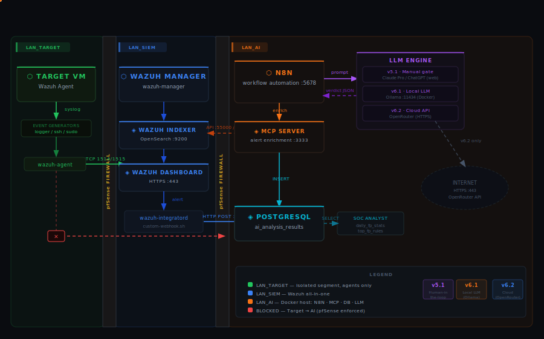

# FPKiller
**An AI-powered False Positive alert triage automation using MCP, N8N, and LLM analysis.**
Automated Wazuh alert triage using N8N, a custom MCP server and a local LLM (Ollama) or cloud API (OpenRouter). Built as a VirtualBox home lab — reproduced at zero cost.

## Problem Statement
**SOC L1 analysts spend 70-80% of time on false positives. This system automates 
FP detection and documentation, reducing analyst workload by ~60%.**

---
 
## Table of Contents
 
- [What This Does](#what-this-does)
- [Architecture](#architecture)
- [Workflow Versions](#workflow-versions)
- [Quick Start](#quick-start)
- [Project Structure](#project-structure)
- [Migration Path](#migration-path)
- [Known Issues & Fixes](#known-issues--fixes)
- [Contributing](#contributing)
- [License](#license)

---

## What This Does

Wazuh and SIEMs generate a large volume of alerts, many of which are false positives from routine system activity. This lab automates the triage process trough a N8N workflow:

1. A Wazuh agent on the **Target VM** sends log events to the **Wazuh SIEM**
2. Wazuh fires a custom webhook that delivers each alert to **N8N**
3. N8N calls the **MCP server** to enrich the alert with Wazuh context (rule details, agent status, historical occurrences in the last 24 h)
4. The enriched prompt is sent to an **LLM** (local Ollama or cloud OpenRouter)
5. The LLM verdict (`false_positive` / `legitimate_threat` / `uncertain`) is saved to **PostgreSQL** with confidence score and reasoning

The result is a queryable dataset of AI verdicts that can drive Wazuh rule tuning over time.

## Architecture



 
### Network Topology
 
```
┌─────────────────────────────────────────────────────────────────────┐
│  PHYSICAL HOST — Ubuntu Desktop                                     │
│                                                                     │
│  ┌──────────────┐   WAN (NAT)     ┌───────────────────────────────┐ │
│  │   pfSense    │◄───────────────►│         Internet              │ │
│  │  Firewall    │                 └───────────────────────────────┘ │
│  │              │                                                   │
│  │  LAN_AI      │◄──────────────── 10.LAB.AI.0/24                   │
│  │  LAN_SIEM    │◄──────────────── 10.LAB.SIEM.0/24                 │
│  │  LAN_TARGET  │◄──────────────── 10.LAB.TARGET.0/24               │
│  └──────┬───────┘                                                   │
│         │                                                           │
│   ┌─────▼──────────────────┐   ┌──────────────┐  ┌──────────────┐   │
│   │   Ubuntu AI Docker     │   │  Wazuh SIEM  │  │  Target VM   │   │
│   │   10.LAB.AI.X          │   │  10.LAB.     │  │  10.LAB.     │   │
│   │                        │   │  SIEM.X      │  │  TARGET.X    │   │
│   │  ┌─────┐ ┌───────────┐ │   │              │  │              │   │
│   │  │ N8N │ │MCP Server │ │   │  Wazuh       │  │  Wazuh       │   │
│   │  │5678 │ │   3333    │ │◄──│  Manager     │◄─│  Agent       │   │
│   │  └──┬──┘ └─────┬─────┘ │   │  Indexer     │  │              │   │
│   │     │          │       │   │  Dashboard   │  │  Generates   │   │
│   │  ┌──▼──┐ ┌─────▼─────┐ │   │  55000/443/  │  │  test events │   │
│   │  │ PG  │ │  Ollama   │ │   │  9200        │  │              │   │
│   │  │5432 │ │  11434    │ │   └──────────────┘  └──────────────┘   │
│   │  └─────┘ └───────────┘ │                                        │
│   │  ┌─────┐               │                                        │
│   │  │Redis│               │                                        │
│   │  │6379 │               │                                        │
│   │  └─────┘               │                                        │
│   └────────────────────────┘                                        │
└─────────────────────────────────────────────────────────────────────┘
```

### Data Flow
 
```
Target VM
  │  logger / SSH fail / syscheck events
  ▼
Wazuh Manager
  │  custom-webhook.sh  (called by wazuh-integratord)
  ▼
N8N  :5678/webhook/<uuid>
  │
  ├─► Extract Alert       (normalise body envelope)
  │
  ├─► MCP Server :3333    (JWT auth → Wazuh API :55000)
  │     ├─ get_rule_details      (API)
  │     ├─ search_alerts_by_rule (OpenSearch :9200)
  │     └─ get_agent_info        (API)
  │
  ├─► Build LLM Prompt    (rule + agent + log + context)
  │
  ├─► LLM  ─── Ollama :11434   (local, no cost, needs GPU/CPU)
  │       └─── OpenRouter API  (free tier, cloud, no GPU)
  │
  └─► PostgreSQL           (ai_analysis_results)
```

### Firewall Segmentation
 
| Zone | Subnet | Can reach |
|---|---|---|
| LAN_AI | 10.LAB.AI.0/24 | LAN_SIEM (query), Internet (LLM APIs) |
| LAN_SIEM | 10.LAB.SIEM.0/24 | LAN_AI (webhook push), Internet (updates) |
| LAN_TARGET | 10.LAB.TARGET.0/24 | LAN_SIEM (agent logs), Internet |
| LAN_TARGET | — | **BLOCKED** from LAN_AI (hard rule) |
 
---

## Workflow Versions
 
| Version | LLM | Human gate | GPU needed | Cost |
|---|---|---|---|---|
| **v5.1** `_manual` | ChatGPT / Claude Pro (web) | Yes — copy/paste | No | $0 |
| **v6.1** `_ollama` | Ollama local (phi3.5, mistral, etc.) | Fully automatic | Recommended | $0 |
| **v6.2** `_openrouter` | OpenRouter free tier | Fully automatic | No | $0 |
 
**Recommended starting point:** v6.2 if you have no GPU, v6.1 if privacy matters and you have a mid-range CPU/GPU.
 
---

## Quick Start
 
```bash
# 1 — clone the repo on the Ubuntu AI VM after Docker is installed
git clone [https://github.com/PinkHood-xv/FPKiller.git]
cd FPKiller
 
# 2 — create your local .env from the example
cp .env.example .env
nano .env   # fill in your values — see .env.example comments
 
# 3 — build and start the core stack
docker compose up -d postgres redis mcp-server
docker compose logs mcp-server   # wait for "Starting MCP Server on port 3333"
 
# 4 — start N8N
docker compose up -d n8n
# open http://$AI_HOST:5678 and import the workflow from n8n-workflows/
 
# 5 — (optional) start Ollama and pull a model
docker compose up -d ollama
docker exec -it ollama ollama pull phi3.5
# or the best model your hardware supports
```
 
Full step-by-step setup is in [docs/SETUP.md](docs/SETUP.md).
 
---

### Quick connectivity tests
 
```bash
# MCP server alive
curl http://$AI_HOST:3333/health
 
# MCP can reach Wazuh
curl -X POST http://$AI_HOST:3333/tools/get_recent_alerts \
  -H "Content-Type: application/json" \
  -d '{"limit": 3}'
 
# Ollama model loaded
curl http://$AI_HOST:11434/api/tags
 
# N8N webhook registered (replace UUID with yours from the workflow)
curl -X POST http://$AI_HOST:5678/webhook/<your-uuid> \
  -H "Content-Type: application/json" \
  -d '{"test":"ping"}'
```
 
---

## Demo
[GIF or video of system in action]

## Project Structure
 
```
FPKiller/
│
├── README.md
├── LICENSE
├── .env.example
├── .gitignore
├── docker-compose.yml
│
├── mcp-server/
│   ├── Dockerfile
│   ├── requirements.txt
│   └── src/
│       └── mcp_server.py          # Flask + JWT Wazuh auth + OpenSearch alerts
│
├── ai-agent/
│   ├── Dockerfile
│   └── src/
│       └── agent.py               # Placeholder for future direct-API automation
│
├── n8n-workflows/
│   ├── wazuh_fp_detector_v5.1_manual.json     # Semi-manual with Wait/Resume
│   └── wazuh_fp_detector_v6.2_openrouter.json # Fully automatic, OpenRouter
│
├── wazuh/
│   ├── ossec.conf.snippet         # <integration> block only
│   ├── local_rules.xml            # Custom test rules 100001-100030
│   └── custom-webhook.sh          # Called by wazuh-integratord
│
├── scripts/
│   ├── show_pending.sh            # v5.1: display pending alerts + prompt
│   ├── send_response.sh           # v5.1: POST manual verdict to resume URL
│   ├── health_check.sh            # Check all services
│   └── backup.sh                  # Dump DB + export N8N workflows
│
├── database/
│   └── init.sql                   # All CREATE TABLE / VIEW statements
│
├── pfSense/
│   ├── firewall_rules.md          # Rule tables (no XML export)
│   └── aliases.md                 # IP and port aliases
│
└── docs/
    ├── ARCHITECTURE.md
    ├── SETUP.md
    ├── WORKFLOW_KNOWLEDGE_BASE.md  # N8N 2.1.4 bugs, SQL patterns
    ├── BUGFIX_LOG.md
    └── OPENROUTER_SETUP.md
```
 
---

## Migration Path
 
The project is designed so each stage is a one-way door with a documented rollback.
 
```
STAGE 1 — Manual (v5.1)
  Zero API cost. Copy/paste prompt to any web AI.
  Human reviews every alert before saving verdict.
  Good for: building ground truth dataset, calibrating prompts.
 
        ▼  enable Ollama node in N8N, disable Wait node
 
STAGE 2 — Local LLM (v6.1 Ollama)
  Fully automatic. No internet needed for inference.
  Full data privacy — nothing leaves your VMs.
  Good for: high-volume testing, air-gapped environments.
  Requires: mid-range CPU (slow) or GPU (fast).
 
        ▼  swap Ollama node for OpenRouter HTTP node
 
STAGE 3 — Cloud Free Tier (v6.2 OpenRouter)
  Fully automatic. No GPU needed.
  Free tier covers lab volumes comfortably.
  Good for: quick setup, better model quality than small local models.
 
        ▼  enable Anthropic/OpenAI node (same node slot)
 
STAGE 4 — Production API (future)
  Direct Anthropic or OpenAI call.
  Best model quality and reliability.
  Costs money at scale.
```
 
Rollback at any stage: re-import the previous workflow JSON and redeploy — the database schema and MCP server are unchanged across all versions.
 
---

## Use Cases
1. **Automatic triage**: Runs every 5 min, auto-closes obvious FPs
2. **On-demand analysis**: Analyst requests deep-dive on specific alert
3. **Pattern detection**: Identifies recurring FP patterns for rule tuning

## Known Issues & Fixes
 
See [docs/BUGFIX_LOG.md](docs/BUGFIX_LOG.md) for the full list.
 
---

## Contributing
 
1. Fork the repository
2. Create a feature branch: `git checkout -b feature/your-improvement`
3. Never commit real credentials, IPs, or `.env` files — the CI check will reject them
4. Update `docs/BUGFIX_LOG.md` if you fix a known issue
5. Open a pull request with a description of what changed and why
### Adding a new LLM backend
 
The integration point is the **Build LLM Request** Code node in N8N. It outputs an `ollama_body` (or equivalent) object that the HTTP Request node sends to the model endpoint. To add a new backend:
 
1. Duplicate the HTTP Request node and point it to your endpoint
2. Adjust the `Build LLM Request` Code node to produce the correct payload shape
3. Verify `Parse LLM Response` can handle the new response format
4. Document the new model in `docs/OPENROUTER_SETUP.md` or a new file

---

## Future Updates

1. Dashboard metriche Grafana dashboard con:

- FP detection accuracy over time
- Time saved vs manual triage
- Top FP categories
- Escalation rate

2. Feedback loop:

- L2 può marcare decisioni errate
- Sistema impara e migliora prompt/logic
- Logging per audit trail completo

3. Report automatici:

- Daily summary: "Today closed 45 FPs automatically, escalated 3 TPs"
- Weekly pattern analysis
- Export in formato SOC-friendly

4. Integrazione Threat Intel:

- VirusTotal API per hash
- AbuseIPDB per IP reputation
- URLhaus per domini
- Mostra come arricchimento migliora accuracy

---
 
## License
 
MIT — see [LICENSE](LICENSE).
 
---
